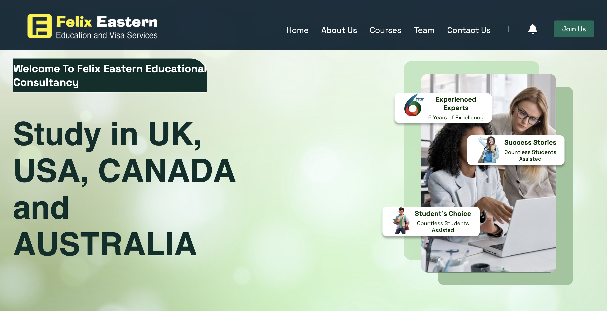
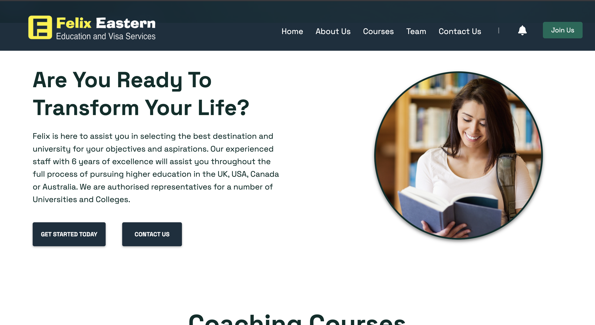
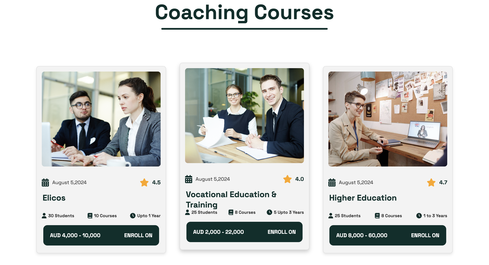
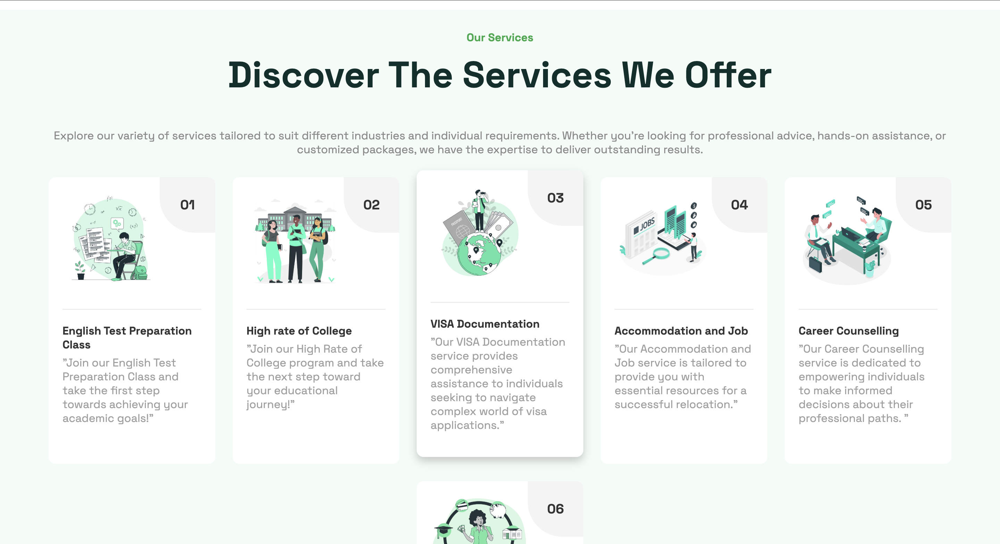
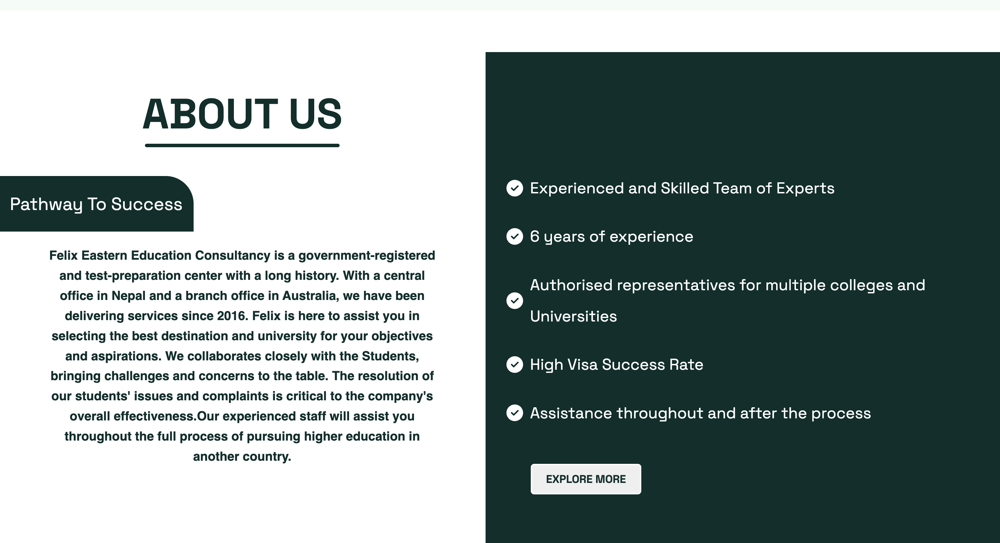
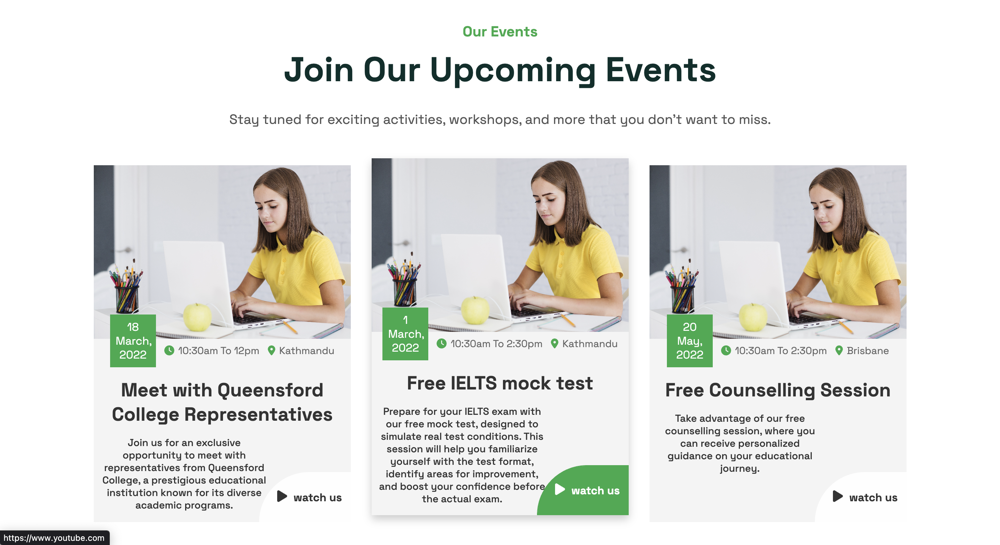
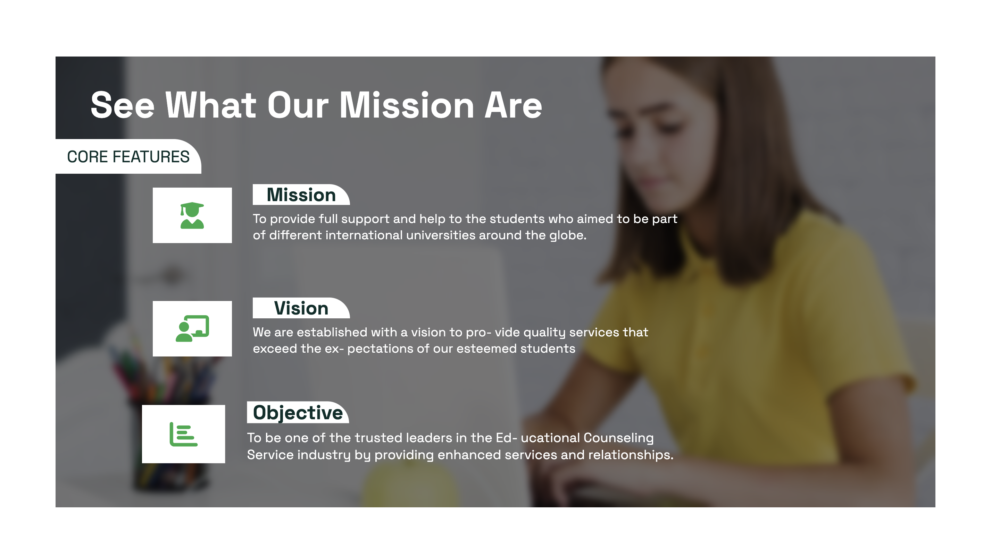
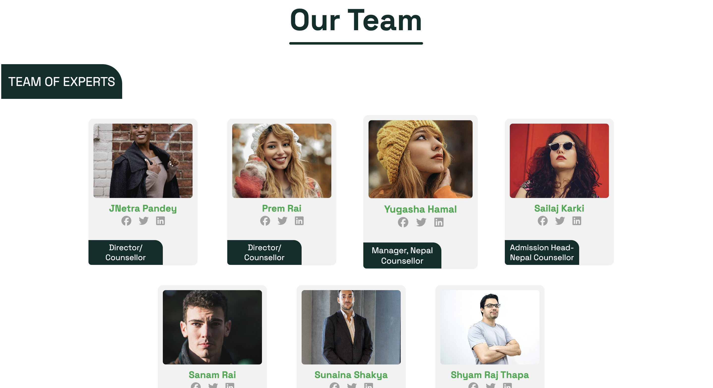
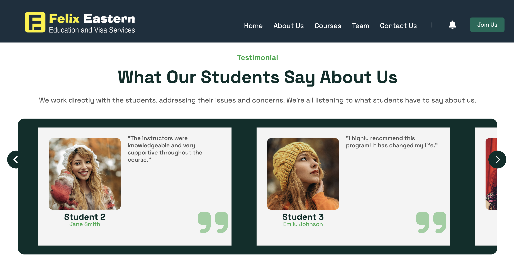
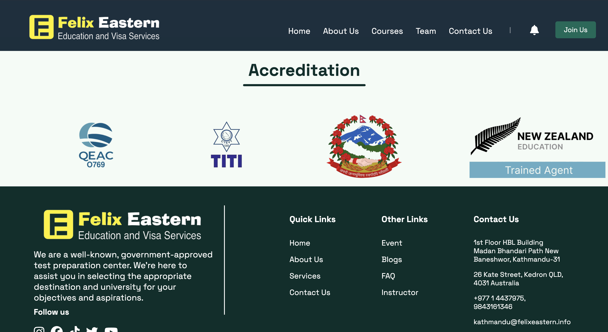

# 🧭 Consultancy Website

A professional and responsive **Consultancy Website** built with **React**, **SCSS**, and **JavaScript**, designed to represent consulting services, team information, and contact forms for business outreach and client acquisition.

---

## 🖥️ Live Demo

🌐 [Visit the Live Website](https://your-deployment-link.com)

---

## ✨ Features

- ✅ Fully responsive layout for desktop, tablet, and mobile
- 🧠 Smooth and modern user interface
- 🧑‍💼 Dedicated sections for About, Services, Team, and Contact
- 💬 Integrated contact form (custom form handler or service)
- 🎨 Styled using modular **SCSS** for maintainability
- ⚡ Fast performance and optimized assets

---
## 📸 Screenshots

<p align="center">
  
  
  
</p>
<p align="center">
  
  
  
</p>
<p align="center">
  
  
  
</p>
<p align="center">
  
</p>


---

## 🛠️ Tech Stack

| Layer       | Technology     |
|-------------|----------------|
| 💻 Frontend | React JS       |
| 🎨 Styling  | SCSS           |
| 🌐 Language | JavaScript     |
| 📦 Tooling  | Vite / Create React App (CRA) |
| 🔧 Others   | EmailJS / Netlify Forms / Custom APIs |

---

## 🚀 Getting Started

> Follow these steps to run the project locally:

```bash
# 1. Clone the repository
git clone https://github.com/yourusername/consultancy-website.git

# 2. Navigate to the project directory
cd consultancy-website

# 3. Install dependencies
npm install

# 4. Start the development server
npm start
```
---
## 📬 Contact

For feedback or questions, reach out via:

- 💼 LinkedIn: [Swen Shrestha](https://www.linkedin.com/in/swen-shrestha-a89041304/)

- 📧 Email: [shresthaswen80@gmail.com](mailto:shresthaswen80@gmail.com)

## ⭐️ Show Your Support

If you like this project, please ⭐️ it and share it with your friends!

---
gi